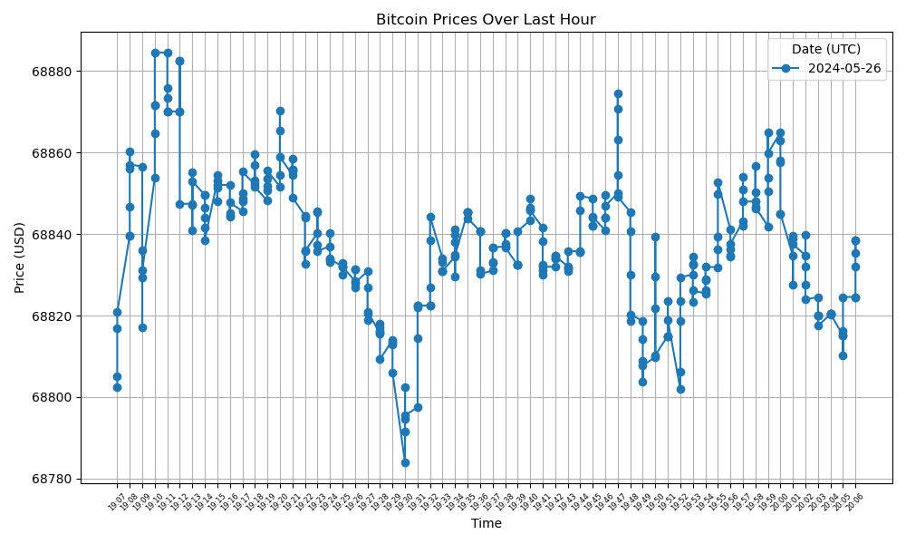

# Bitcoin Price Fetching, Storing, and Visualization

This project consists of three Python scripts that fetch, store, and visualize Bitcoin prices using Coinbase API, Kafka, AWS DynamoDB, and Matplotlib.

## Components

1. **Coinbase Producer** (`coinbase_producer.py`):
    - Fetches historical Bitcoin prices from the Coinbase API.
    - Sends the prices to a Kafka topic named `crypto_prices`.

2. **DynamoDB Consumer** (`dynamodb_consumer.py`):
    - Consumes Bitcoin price data from the Kafka topic `crypto_prices`.
    - Stores the data in an AWS DynamoDB table named `BitcoinPrices`.

3. **Data Visualization** (`visualize_data.py`):
    - Retrieves Bitcoin price data from the DynamoDB table.
    - Plots the data using Matplotlib.

## Prerequisites

- Python 3.x
- Kafka
- AWS account with DynamoDB access
- Required Python packages: `requests`, `kafka-python`, `boto3`, `matplotlib`

## Setup

### 1. Install Required Packages

```sh
pip install requests kafka-python boto3 matplotlib
```

### 2. Kafka Setup

Ensure Kafka is installed and running on your system. Create a Kafka topic named `crypto_prices`.

### 3. AWS Setup

Ensure you have an AWS account and set up your AWS credentials. Create a DynamoDB table named `BitcoinPrices`.

## Scripts Overview

### `coinbase_producer.py`

Fetches historical Bitcoin prices from the Coinbase API and sends them to a Kafka topic.

#### Logging Setup
Logs messages to a rotating file handler to track activity and errors.

#### Function `fetch_historical_prices`
Fetches historical Bitcoin prices from Coinbase API and returns a list of prices with timestamps.

#### Kafka Producer
Sends each price data as a JSON message to the `crypto_prices` Kafka topic.

#### Main Function
Fetches historical prices, sends each price data to Kafka, and then sleeps for an hour before repeating.

### `dynamodb_consumer.py`

Consumes Bitcoin price data from the Kafka topic and stores it in an AWS DynamoDB table.

#### Logging Setup
Logs messages to the console.

#### DynamoDB Setup
Initializes the DynamoDB table. If the table does not exist, it creates one.

#### Kafka Consumer
Consumes messages from the Kafka topic `crypto_prices`.

#### Function `store_bitcoin_price`
Stores each Bitcoin price data into the DynamoDB table.

### `visualize_data.py`

Retrieves Bitcoin price data from the DynamoDB table and plots it using Matplotlib.

#### Function `retrieve_data_from_dynamodb`
Retrieves all Bitcoin price data from the DynamoDB table.

#### Function `plot_bitcoin_prices`
Plots the retrieved Bitcoin price data using Matplotlib.

## Running the Scripts

### 1. Coinbase Producer

```sh
python coinbase_producer.py
```

### 2. DynamoDB Consumer

```sh
python dynamodb_consumer.py
```

### 3. Data Visualization

```sh
python visualize_data.py
```

## Note

- Ensure Kafka and DynamoDB are properly set up and running before executing the scripts.
- Adjust AWS credentials and region settings as needed in the `dynamodb_consumer.py` and `visualize_data.py` scripts.
- The producer script fetches and sends data every hour. You can adjust the sleep interval as needed.

## Output Graph

Below is a sample graph generated by the `visualize_data.py` script, displaying Bitcoin prices over the last hour:



This graph shows the fluctuations in Bitcoin prices within the given timeframe, providing a visual representation of the market trend. Each point on the graph represents a recorded price at a specific time, with the x-axis denoting the time and the y-axis denoting the price in USD. The data is plotted to highlight the changes in price throughout the hour, offering insights into the volatility and movement of Bitcoin prices.
